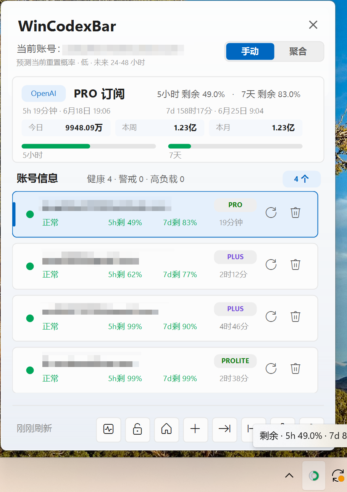
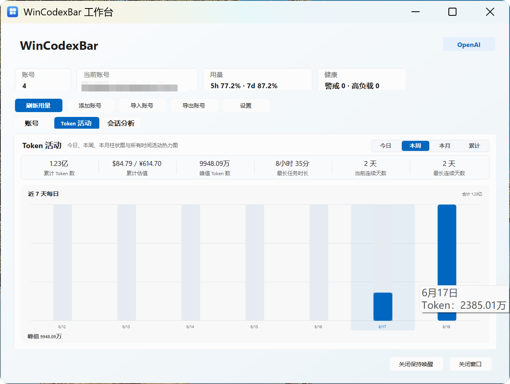
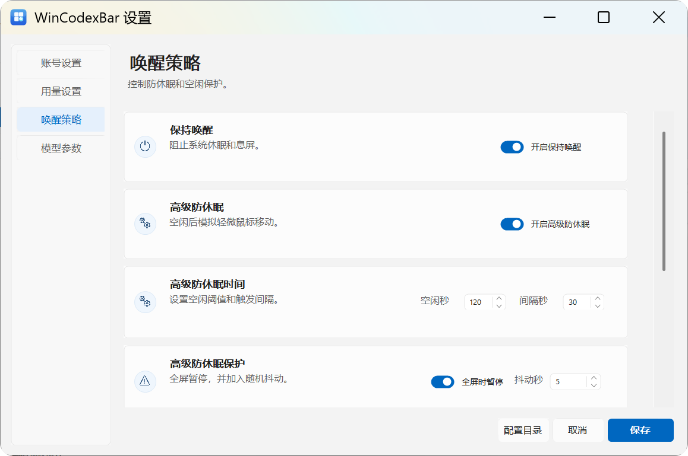

# WinCodexBar

[English](./README.en.md)

> 面向 Windows 的 Codex 托盘工作台：管理多个 OpenAI OAuth 账号，查看 5 小时 / 7 天额度，分析本地 Token 活动，并通过聚合模式让多账号使用更连续。
>
> English: A Windows tray workspace for Codex multi-account management, quota visibility, local token activity, and aggregate account routing.

## 项目简介 / About

WinCodexBar 是一个专为 Windows Codex 用户准备的托盘工具。它把多账号管理、额度监控、Token 活动、会话分析、导入导出、保持唤醒和聚合路由放在一个轻量界面里，减少反复切换账号、修改配置和检查用量带来的中断。

English: WinCodexBar is a Windows tray app for Codex users. It brings multi-account management, quota tracking, token activity, session analysis, import/export, keep-awake controls, and aggregate account routing into one lightweight desktop workflow.

## 核心价值

### 聚合模式让账号切换更连续

聚合模式会启动一个本地账号网关，把多个 OpenAI OAuth 账号作为账号池管理。新的 Codex 实例接入本地网关后，账号选择和请求路由交给 WinCodexBar 处理，不需要你频繁手动修改每个项目里的账号配置。

这对多项目和长会话尤其有用：你可以在一个地方查看所有账号额度，选择更健康的账号继续工作。已经接入聚合网关的新 Codex 实例可以跟随路由策略使用账号；如果某个 Codex 实例是在开启聚合模式之前启动的，通常需要重启 Codex 或新开实例后才会接入本地网关。

### 切换账号不等于丢失项目会话

WinCodexBar 切换的是 OAuth 身份和请求路由，不会主动清空你的项目目录、本地会话记录或 Codex 的项目上下文文件。你可以把账号理解为“请求身份”，把项目会话理解为“本地工作记忆”：WinCodexBar 改前者，不会删除后者。

实际使用时，如果你在手动模式下切换账号，已运行的 Codex 实例通常需要重启或新开一次，才能使用新的账号配置；聚合模式则把后续账号路由集中到本地网关里处理。

### 额度和用量一眼看清

托盘图标用圆环显示近 5 小时额度状态；菜单和工作台展示 5 小时 / 7 天额度、健康状态、预计重置时间，以及今日、本周、本月和累计 Token 活动。你不用等到请求失败才发现账号已经接近额度耗尽。

## 界面预览

### 托盘菜单

轻量弹出菜单用于快速查看当前账号、额度、订阅类型和账号池状态，也可以直接切换模式、添加账号、打开工作台或进入设置。

<p>
  
</p>

### 工作台

工作台提供账号列表、Token 活动、会话分析和成本估算。柱状图和热力图用于快速观察今日、本周、本月和累计 Token 使用情况。

<p>
  
</p>

### 设置页

设置页集中配置账号模式、用量显示、唤醒策略和模型参数。唤醒策略支持系统保持唤醒和高级防休眠。

<p>
  
</p>

## 解决什么问题

当你同时使用多个 OpenAI 账号时，常见问题通常是：

- 不知道当前账号的 5 小时 / 7 天额度还剩多少。
- 手动改配置容易出错，也不方便回到上一个账号。
- 多项目同时使用 Codex 时，账号切换会打断工作流。
- 多账号导入、备份和迁移不够顺手。
- 长时间编码时 Windows 休眠或锁屏会打断节奏。
- 本地会话 Token 用量、今日/本周/本月趋势不够直观。

WinCodexBar 把这些能力集中在托盘菜单、工作台和设置页里，适合长时间使用 Codex 的 Windows 用户。

## 主要功能

### 托盘菜单

- 单击托盘图标打开快捷菜单。
- 双击可打开工作台。
- 托盘图标使用近 5 小时额度圆环显示当前账号状态。
- 鼠标悬停托盘图标可查看当前 5 小时 / 7 天额度。
- 点击菜单外部自动收起。

### 多账号管理

- 添加 OpenAI OAuth 账号。
- 支持浏览器授权回调自动捕获。
- 自动捕获失败时，可手动粘贴浏览器地址栏中的回调 URL。
- 导入 / 导出多账号文件，方便备份和迁移。
- 删除账号前会进行二次确认。
- 当前账号切换后会同步到 Codex 配置。

### 手动模式与聚合模式

- 手动模式：点击账号后写入当前账号配置，已运行的 Codex 实例通常需要重启后才会使用新账号。
- 聚合模式：启动本地账号网关，让新的 Codex 实例通过本地地址进行账号路由。
- 聚合模式适合多项目、多账号和长会话场景，可以减少反复编辑账号配置带来的中断。
- 如果 Codex 是开启聚合模式之前已经打开的实例，通常需要重启 Codex 或新开实例后才会接入聚合路由。

### 额度显示

- 展示每个账号的订阅类型、健康状态、5 小时额度和 7 天额度。
- 可在设置中选择显示“已用额度”或“剩余额度”。
- 可在设置中选择 Token 数字单位：中文单位或 K/M/B。
- 剩余额度低于 30% 显示橙色，低于 10% 显示红色。
- 可查看预计重置时间，包含倒计时和具体日期时间。

### 工作台

- 汇总账号数量、当前账号、额度状态和健康状态。
- 显示全部账号列表，支持刷新、切换和查看状态。
- Token 活动页展示今日、本周、本月柱状图和累计热力图。
- 会话分析页展示本地会话数量、活跃/归档情况、Token 最高会话和最近会话。
- Token 成本可按模型价格预设估算美元和人民币金额。

### 防休眠

- 保持唤醒：调用 Windows 系统能力阻止休眠和息屏。
- 高级防休眠：空闲后模拟轻微鼠标移动，可配置空闲阈值、触发间隔、抖动时间和移动策略。
- 可设置全屏时暂停高级防休眠。
- 支持随 Windows 开机启动。

### 设置

- 账号设置：切换手动 / 聚合模式。
- 用量设置：切换额度显示方式、Token 单位、自动刷新间隔、健康阈值和价格预设。
- 唤醒策略：配置保持唤醒、高级防休眠和开机启动。
- 模型参数：配置默认模型、Review 模型、reasoning effort 和 service tier。

## 安装与运行

从发布包中选择与你的系统架构匹配的版本：

- `WinCodexBar-0.1.0-win-x64.zip`：大多数 Intel / AMD 64 位 Windows 设备。
- `WinCodexBar-0.1.0-win-x86.zip`：旧的 32 位 Windows 设备。
- `WinCodexBar-0.1.0-win-arm64.zip`：Windows on ARM 设备。

解压后运行 `WinCodexBar.exe`。首次运行后会出现在系统托盘区域。

## 本地构建

需要 .NET 8 SDK。

```powershell
dotnet restore windows\CodexBarWin\CodexBarWin.csproj
dotnet build windows\CodexBarWin\CodexBarWin.csproj -c Release
```

发布单文件执行包示例：

```powershell
dotnet publish windows\CodexBarWin\CodexBarWin.csproj -c Release -r win-x64 --self-contained true -p:PublishSingleFile=true -p:IncludeNativeLibrariesForSelfExtract=true
```

## 数据与隐私

- 账号数据默认保存在本机配置目录。
- 应用不会在日志、界面或导出说明中显示 access token、refresh token 或 id token。
- 导出的账号文件属于敏感数据，请妥善保存，不要公开上传。
- Token 活动和会话分析来自本地 Codex 会话文件，仅用于本机展示和估算。

## 注意事项

- 切换账号不会删除项目文件或本地会话记录，但已运行的 Codex 实例可能仍使用旧账号；需要重启 Codex 或新开实例才能确保使用新账号。
- 聚合模式需要 Codex 使用本地网关地址；切换前已经打开的 Codex 实例通常不会自动接入。
- 金额统计是基于本地 Token 和价格预设的估算，不等于官方账单。
- 高级防休眠会模拟轻微鼠标移动，请根据自己的使用场景谨慎开启。
- 如果 Windows 安全软件拦截单文件执行包，请确认文件来源后再放行。

## 版本

当前版本：`0.1.0`

更新内容见 [CHANGELOG.md](./CHANGELOG.md)。

## License

本项目使用 MIT License。详见 [LICENSE](./LICENSE)。
