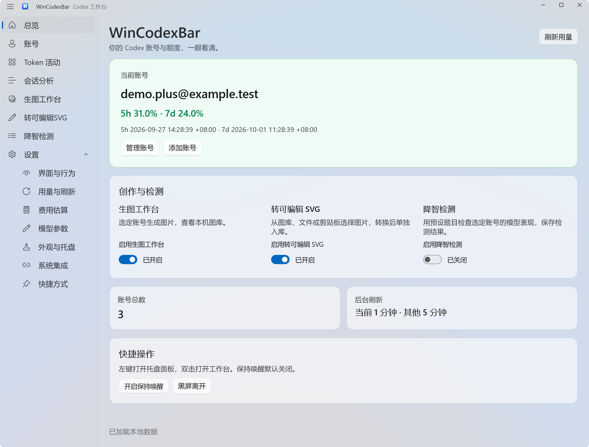
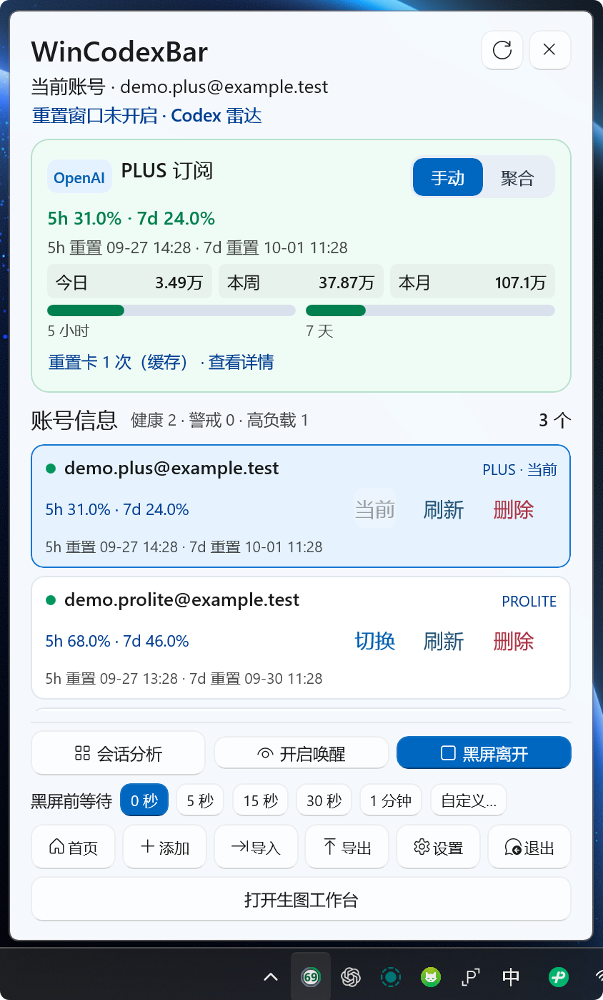
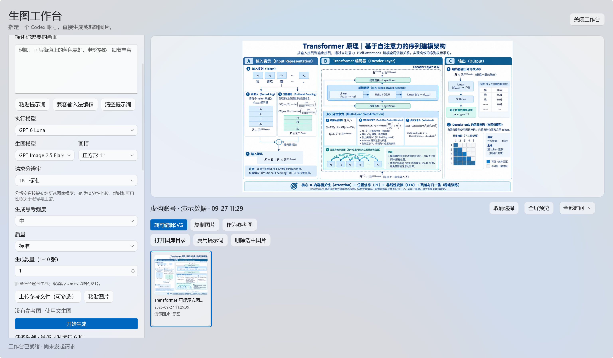
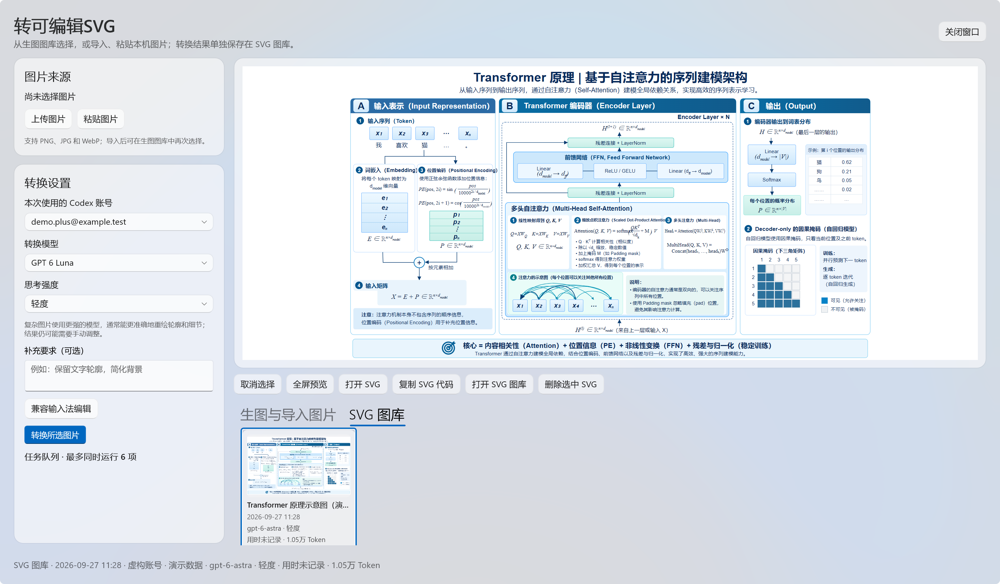
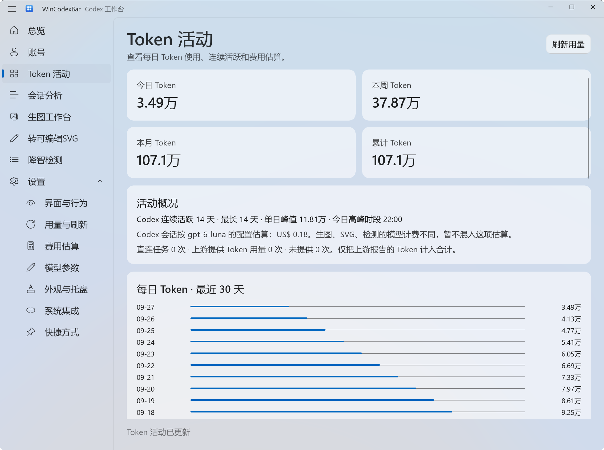
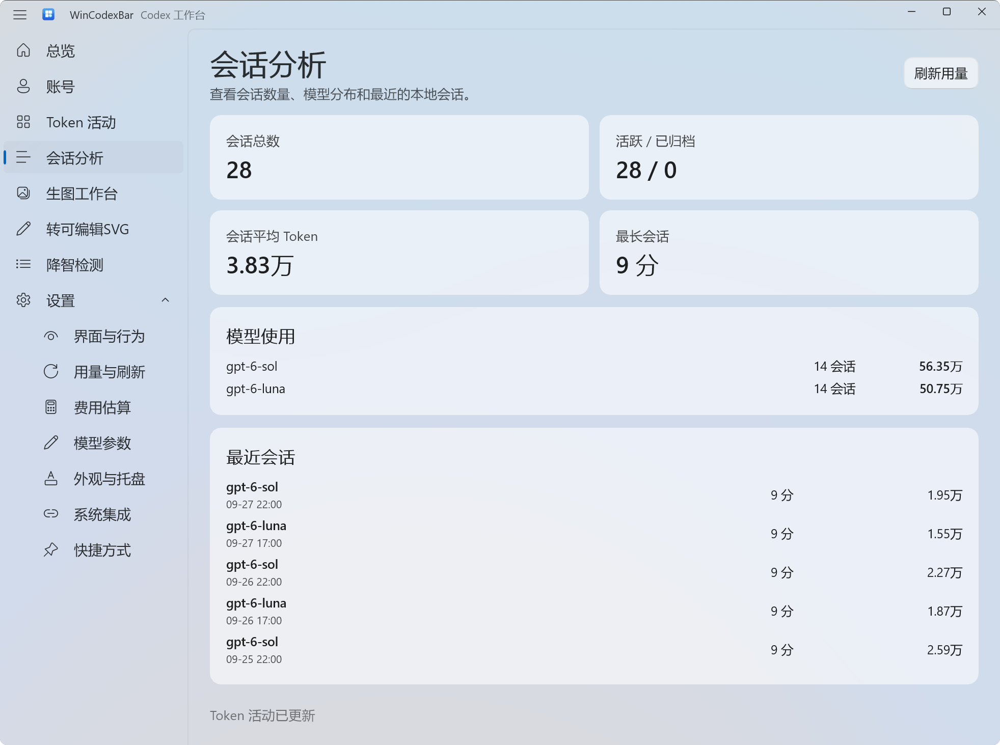
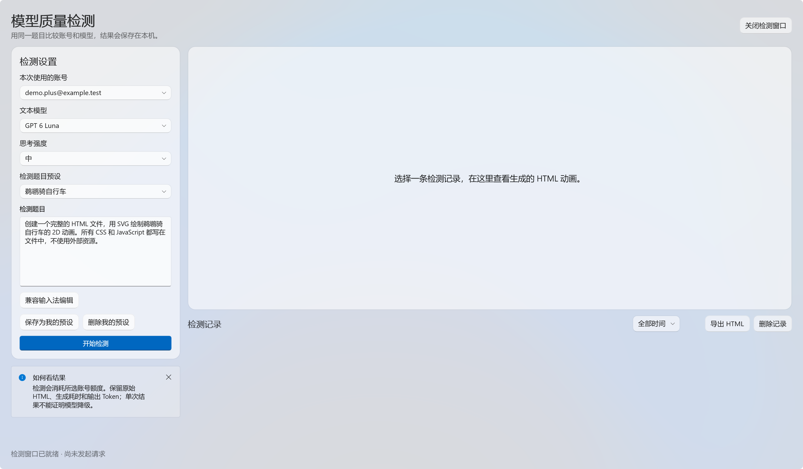
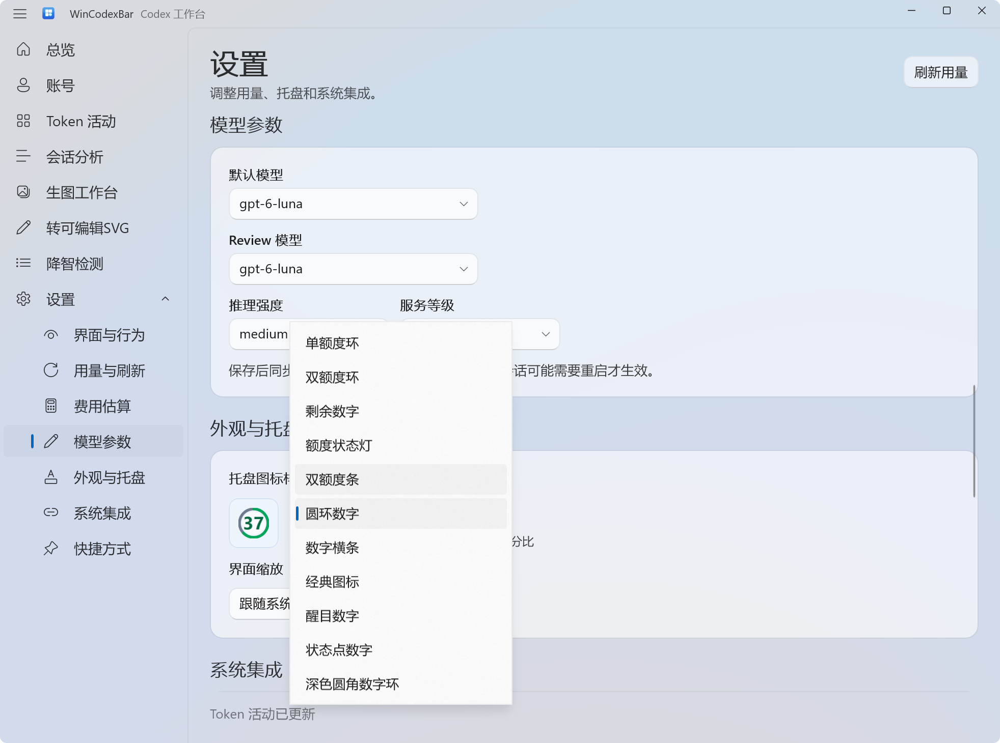
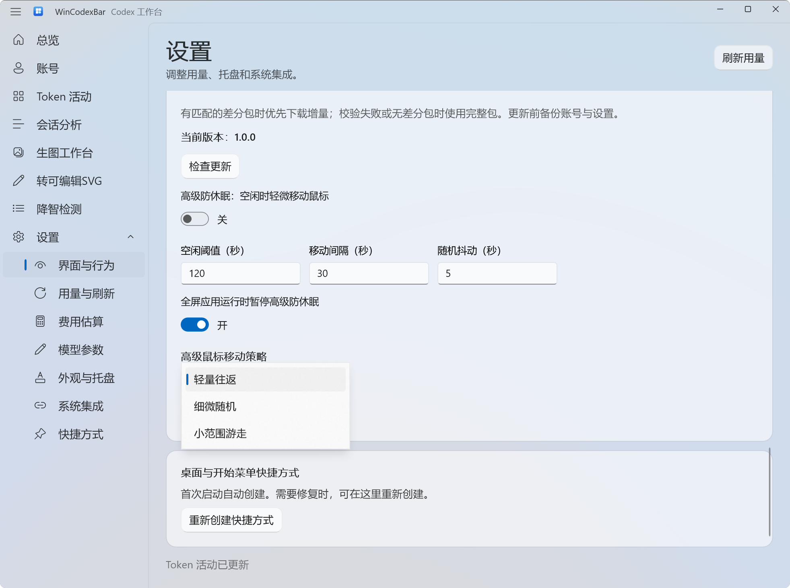

# WinCodexBar

**把 Codex 账号、额度和创作工具放进 Windows 托盘。**

[English](README.en.md) · [下载 v1.0.0](https://github.com/windycn/WinCodexBar/releases/tag/v1.0.0) · [更新记录](CHANGELOG.md)

WinCodexBar 是 Windows 上的 WinUI 3 工作台。日常用托盘速览额度和切换账号，需要时打开主界面查看 Token、会话、图库和设置。生图、转可编辑 SVG、模型质量检测分别按需开启，首次安装默认关闭。

## 界面一览

以下九张截图由演示账号拍摄；仓库不包含真实账号、登录凭据或私人图库文件。

| 总览与功能开关 | 托盘速览 |
| --- | --- |
|  |  |

| 生图工作台 | 转可编辑 SVG |
| --- | --- |
|  |  |

| Token 活动 | 会话分析 |
| --- | --- |
|  |  |

| 模型质量检测 | 托盘样式 |
| --- | --- |
|  |  |



## 安装与开始使用

1. 到 [Releases](https://github.com/windycn/WinCodexBar/releases) 下载对应架构的 `WinCodexBar-1.0.0-win-x64.zip`、`win-x86.zip` 或 `win-arm64.zip`。
2. 解压到独立、可写的文件夹，运行 `WinCodexBar.exe`。不要直接从压缩包里运行。首次启动时，启动器会按需安装随包提供、经微软签名的 Windows App Runtime。
3. 在托盘单击图标打开速览面板，双击打开 WinUI 工作台。通过“添加账号”前往 OpenAI 官方授权；授权链接可复制到别的设备打开，再把回调链接粘贴回来。

账号切换后，**重启 Codex 才会应用新账号**。WinCodexBar 会在切换时提醒。账号和设置保存在 `%USERPROFILE%\.codexbar`；设置 `CODEXBAR_HOME` 后，数据改存于该目录下的 `.codexbar`。

### 账号与额度

- 保存多个 Codex 账号，手动切换或聚合查看；刷新 5 小时和 7 天额度、重置时间与账号状态。鼠标悬停账号时，有重置卡才显示其到期时间。
- 托盘默认使用圆环数字样式，可在设置中预览并切换其他样式。额度低于设定阈值、重置窗口开启等关键事件可发 Windows 通知，并避免重复提醒。
- 导入默认支持 [codexbar](https://github.com/lizhelang/codexbar) JSON，也支持包含完整 OAuth 凭据的 Codex2API JSON 和旧版 CSV；导出默认是 codexbar JSON，也可选择其他格式。**导出文件含可使用账号的凭据，请妥善保存，勿公开上传。**

### 生图工作台

在总览开启后，从左侧导航或托盘进入。工作台是独立 WinUI 窗口，**不启动网页服务、不运行反向代理或号池**；每次明确选定一个已保存的 Codex 账号。能否生图取决于该账号及上游接口的可用性。

编辑、粘贴提示词，选择执行模型、生图模型、画幅、分辨率、质量与思考强度；一次生成 1–10 张。可上传多张参考文件，也可从剪贴板粘贴参考图。任务显示排队、运行及结果，图片和 SVG 任务合计最多并行 6 项。结果以缩略图卡片保存在本机图库，记录提示词、模型、时间等信息；可以按时间查看、全屏预览、复制图片并粘贴到 Word 或 PowerPoint，也可以直接送往“转可编辑 SVG”。模型等选择会记住上次设置。

### 转可编辑 SVG

此功能有独立的总览开关和窗口。可从生图图库选历史或刚生成的图片，也可上传、粘贴本机图片。为本次转换单独选择 Codex 账号、文本模型、思考强度及补充要求。**复杂图片使用更强的模型，通常能更准确地重绘轮廓与细节**；结果仍可能需要手工调整。转换成果单独保存到 SVG 图库，可全屏预览、打开 SVG 文件及复制 SVG 代码。

生图与 SVG 图库目录均可自定义。图片、索引元数据和回收站分开存放；不完整或失配文件进入回收站，可手动或按保留天数清理。

### 统计与检测

“Token 活动”按日展示用量、连续活跃、峰值和费用估算；“会话分析”查看会话数量、模型分布与最近会话。生图、SVG 和模型质量检测也记录各自的消耗。费用根据公开模型价格估算，**不是官方账单**。

模型质量检测可选账号、模型、思考强度和多种预设题，也能保存自己的题目。生成的 HTML 结果直接渲染并留存历史。单次结果只供比较，不能据此判定模型已降级；检测会消耗所选账号的额度。

### 托盘、黑屏与系统集成

托盘速览提供账号操作、保持唤醒、黑屏离开、会话入口和快捷设置。“黑屏离开”通过 Windows 的空闲关屏路径关闭显示器，后台程序继续运行；鼠标或键盘输入可恢复画面。默认等待 0 秒，也有 5、15、30、60 秒和自定义等待。黑屏期间应用会保持系统运行，但 Windows 自身的强制锁屏策略仍由系统决定。

设置中可选启动项、通知、外观缩放、托盘图标和桌面/开始菜单快捷方式。更新页面显示当前版本，可手动检查，也可启用自动检查与静默更新。更新器校验 SHA256、备份账号和设置，再替换程序；如果发布了适用的差分包会优先尝试，失败则使用完整包。

## 开发与验证

需要 Windows 与 .NET 8 SDK。

```powershell
dotnet build windows/CodexBarWin.WinUI/CodexBarWin.WinUI.csproj -c Release -p:Platform=x64
dotnet run --project tests/WinCodexBar.CoreTests -c Release
dotnet run --project tests/GalleryStorageSmoke -c Release
dotnet run --project tests/TrayIconSmoke -c Release
```

发布工作流构建 x64、x86、ARM64，验证 Windows App Runtime 的微软签名，生成 ZIP 与 `SHA256SUMS.txt`。账号导出、图库与截图请在提交前检查，避免把私人资料加入仓库。

## 许可

[MIT](LICENSE) · [第三方组件声明](THIRD_PARTY_NOTICES.md)
